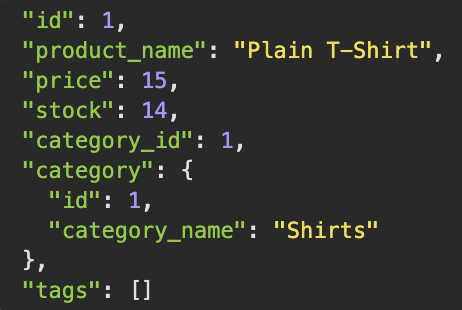
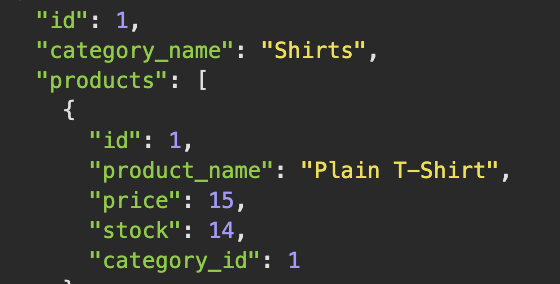
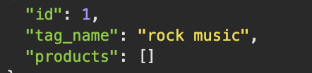
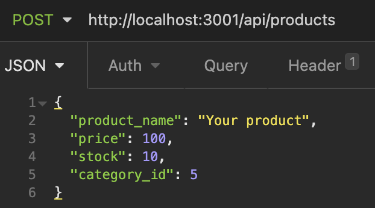
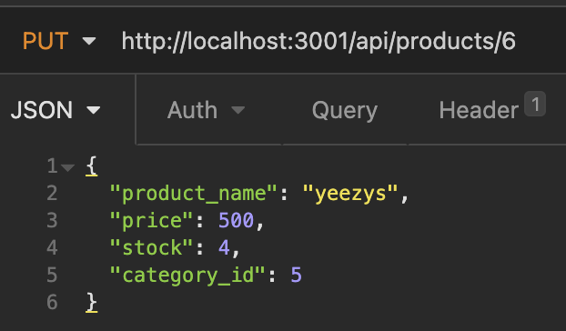
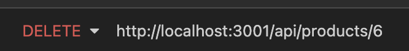

# Backend-E-Com

Back end for an e-commerce site by modifying starter code. I'll configure a working Express.js API to use Sequelize to interact with a MySQL database.

---

[Github](https://github.com/705h-S?tab=repositories)

[Walkthrough-video](https://drive.google.com/file/d/1Kp1v9VaK22umD2qZo48T-ZSA3U_B7BLN/view)

---

## Technologies Use

- [Node](https://nodejs.org/)
- [MySQL](https://dev.mysql.com)
- [MySQL2](https://www.npmjs.com/package/mysql2)
- [Insomnia](https://insomnia.rest/)
- [Express](https://www.npmjs.com/package/express)
- [Sequelize](https://sequelize.org/)

---

## Description

Internet retail, also known as **e-commerce**, is the largest sector of the electronics industry, generating an estimated $29 trillion in 2019. E-commerce platforms like Shopify and WooCommerce provide a suite of services to businesses of all sizes. With this project I'll understand the fundamental architecture of these platforms by creating a Back-end for an e-commerce site.

---

## installtion

Make sure you have node downloaded. <br>
After forking the repo on your terminal do a `npm i` to install all necessary packages.
Then run `npm start` to start the program.
For testing purposes it's best to use the app [insomnia](https://insomnia.rest/).

---

## Usage

After succesfully running the program you can use your browser or insomnia(recomended) to view the data.
In the URL input type ` http://localhost:3001`.
you should get back with this..

> 

Here are end routes for this API

`/api/products`

> Will GET all products <br> 

`/api/categories`

> Will GET all categories <br> 

`/api/tags`

> WIll GET all Tags <br> 

To get a specific product,category or tag simply type
`/api/:route/:id` followed with id pertaining the route.

---

## -- WITH INSOMNIA --

To ADD a product use the POST method.

In the body add the products atributes which are

```json
"product_name:" -- STRING
"price:" -- INTEGER
"stock:" -- INTEGER
"category_id:" -- INTEGER // The category the product will belong too
```



To upate a product use the PUT method.

In the URL insert the id # of the product you'll want to update.



To delete a product use the DELETE method.

In the URL insert the id # of the product you'll want to delete.



The methods are the same with the rest of the routes.

What changes are the attributes of the routes.

> Category attributes

```json
"category_name:" -- STRING
```

> Tag attributes

```json
"tag_name:" --- STRING
```

---

## Learning Points

A major learning point is that I should take every slow and start with one file at a time. Instead of working on multiple files at the same time I should work one.
ALso that I should test my code very often. I noticed I would run into bugs and errors and I wouldn't know where they would be comming from. I'd spend hours looking for the bugs and when I woul find them it would happen to be a spelling mistake. Through this project I managed to practice my skills in [Express](https://www.npmjs.com/package/express) and [Sequelize](https://sequelize.org/). I also got to use the [Insomnia](https://insomnia.rest/) tool which was fun and made it easy to test my routes.

---

## Contributor:

[Joshua Meza](https://705h-s.github.io/portfolio-charlie/)
